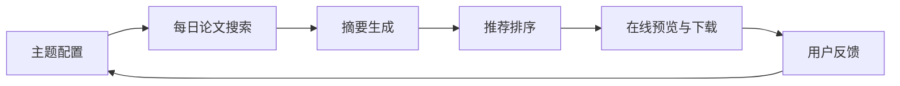

# MVP 架构设计

## 目标

第一版不追求复杂算法，重点是建立一个可以持续迭代的闭环：

## 模块

- `arxiv_client`: 根据主题关键词调用 arXiv API，解析论文标题、作者、摘要、链接、发布时间。
- `summarizer`: 用启发式方法生成中文摘要，保证无外部依赖即可启动。
- `recommender`: 根据关键词命中、发布时间、摘要特征计算推荐分，并生成推荐理由。
- `database`: 使用 SQLite 保存主题、论文、运行记录，降低首版部署成本。
- `server`: 用 Python 标准库提供 API 和静态页面，避免首版依赖膨胀。
- `scheduler`: 服务启动后按小时检查，每天对启用主题运行一次。

## API

- `GET /api/topics`: 获取主题列表。
- `POST /api/topics`: 新增主题。
- `DELETE /api/topics?id=1`: 删除主题。
- `POST /api/run`: 运行所有启用主题或指定主题。
- `GET /api/papers`: 获取论文列表。
- `GET /api/export?format=markdown`: 下载 Markdown。
- `GET /api/export?format=csv`: 下载 CSV。

## 数据模型

- `topics`: 主题名称、搜索语句、每日最大结果数、是否启用。
- `papers`: 论文基础信息、自动摘要、推荐分、推荐理由、所属主题。
- `runs`: 每次搜索的运行时间、主题、拉取数量、状态。

## 设计取舍

- 使用标准库 HTTP 服务，而不是直接引入 Web 框架，是为了让仓库第一天就能运行。
- 摘要先用启发式方法，是为了把产品闭环跑通；之后可以在同一接口后面替换成 LLM。
- SQLite 适合 MVP，后续如果有多人在线访问，可迁移到 Postgres。

